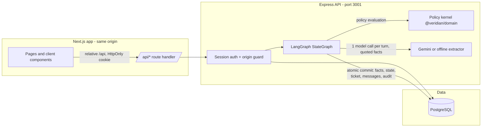

# Veridian Service Desk

Veridian Service Desk is a source-grounded internal service-desk workspace. It keeps
authentication, database access, LangGraph/Gemini orchestration, tickets, and audit records
in the Express API; the Next.js application presents them through a same-origin interface.

Docker is an additional supported way to run the project. It does not replace the normal
Node.js and locally managed PostgreSQL workflow.

## Problem and scope

Veridian Corp's internal service desk receives employee requests by email and in person.
This assessment prototype ingests the supplied source week (21–25 Sep 2026, fictional
data: 11 policy sources, 15 requests, 10 source tickets — 4 active, 6 closed), keeps the
closed records as immutable history, and processes the 19 active cases through a bounded,
policy-grounded workflow. The system answers with exact supplied policy passages, asks a
necessary question when the request is unclear, and creates local handoffs for human
review. It never approves, unlocks, ships or deletes anything outside this sandbox, and it
sends no email.

- **Author:** Ansh Kapoor (AIONOS round-two Assignment 2).
- **Stack:** Next.js/React/TypeScript · Node.js/Express/TypeScript · PostgreSQL (SQL
  migrations, `pg`) · LangGraph.js workflow · LangChain Google adapter · Gemini (optional).
- **Credentials:** created locally in the ignored `private/REVIEWER_CREDENTIALS.txt` by
  `npm run setup`; no password or API key is committed anywhere.

## Offline mode versus live Gemini

The app runs in two clearly labelled modes:

- **Offline (default):** a deterministic rule-based extractor and the tested policy kernel
  produce every outcome. The header badge, case pages and audit events all say so. No key,
  no credits, full functionality.
- **Gemini:** add a `GEMINI_API_KEY` to the ignored `.env` (server-side only, never in the
  browser) and the extractor uses the configured `GEMINI_MODEL` (default
  `gemini-2.5-flash`) with a per-turn timeout and no SDK retries. If Gemini is unavailable
  or returns invalid data, the run falls back to the offline path and is labelled
  `offline-fallback` — it never masquerades as a Gemini completion. Decisions and rendered
  messages always come from the application's own code, so a second model call cannot
  invent new entitlements.

## Architecture



The commit node performs one transaction: updated facts and evidence, new work state,
case version increment, ticket upsert (only when the decision requires a handoff), the
user and assistant messages, and the audit events. No database lock is held while a model
runs, and the UI never says "ticket created" before the transaction has committed.

## Verification

`npm run check` runs strict typechecks, the 72 supplied kernel tests, both production
builds and the database/API integration suite (19 tests) against an isolated `*_test`
database. `npx playwright test` runs the 15 browser flows (desktop and 390px mobile) in
Chromium. Exact commands, results and NOT RUN items are recorded in
[`docs/TEST_REPORT.md`](docs/TEST_REPORT.md); the API surface is documented in
[`docs/API_REFERENCE.md`](docs/API_REFERENCE.md) and AI-tool use in
[`docs/AI_USAGE.md`](docs/AI_USAGE.md).

## Known limitations

- Single local instance; sessions and rate limiting are in-process by design.
- The Gemini path was not exercised live in this verification (no key configured); the
  smoke command is `npm run smoke:gemini`.
- No lint toolchain ships with the pack; strict typecheck plus the test suites are the
  enforced gates.
- No external actions ever occur: no real email, account changes, shipments or approvals.
- This is a verified assessment prototype, not a production-ready product.

## Docker quick start

Prerequisites: Docker Desktop (or Docker Engine) with Docker Compose v2 enabled.

1. Create a local environment file and replace the PostgreSQL password placeholder. Do not
   commit this file.

   ```powershell
   Copy-Item .env.example .env
   ```

2. In `.env`, set `POSTGRES_DB`, `POSTGRES_USER`, `POSTGRES_PASSWORD`, and
   `DEMO_REVIEWER_PASSWORD` to unique local values. Keep the supplied demo name/email or
   change all three `DEMO_REVIEWER_*` values together. Leave `GEMINI_API_KEY` blank for the
   safe offline workflow, or add your own key to enable Gemini. The key is passed only to the
   backend and is never embedded in an image or exposed to the browser.

3. Build and start the complete stack.

   ```powershell
   docker compose up --build
   ```

   For a detached local demo, use `docker compose up --build -d` and inspect logs with
   `docker compose logs -f migrate backend frontend`.

`postgres` starts first and must pass `pg_isready`. The short-lived `migrate` service then
runs `npm run db:bootstrap` (migration followed by idempotent seed). The `backend` does not
start until that task succeeds, and the `frontend` waits for the backend readiness endpoint.

The seed imports the supplied policy data and creates the configured demo reviewer with an
isolated copy of all supplied cases and source tickets. Its password comes only from your
ignored `.env`; it is not printed, committed, or baked into an image. Every signup also gets
its own independent seeded workspace.

## URLs and ports

| Service | Default host address | Container port | Configuration |
| --- | --- | --- | --- |
| Frontend | `http://localhost:3000` | 3000 | `WEB_PORT` |
| Backend | `http://localhost:3001` | 3001 | `API_PORT` |
| PostgreSQL | `localhost:5432` | 5432 | `POSTGRES_PORT` |

Useful backend checks are `http://localhost:3001/api/health/live` and
`http://localhost:3001/api/health/ready`. The latter is also the Compose backend healthcheck.

Browser code uses only relative `/api/...` requests. Inside Docker, the Next.js route handler
proxies those requests to `http://backend:3001`; server-side code therefore works without
trying to resolve a browser's `localhost`. The API reaches PostgreSQL as `postgres:5432`, never
as container-local `localhost`.

## Docker environment reference

The checked-in `.env.example` is the complete starting point and contains no real credentials.
These variables matter to Compose:

| Variable | Purpose |
| --- | --- |
| `POSTGRES_DB`, `POSTGRES_USER`, `POSTGRES_PASSWORD` | Required database name and credentials. Choose a real local password in `.env`. |
| `WEB_PORT`, `API_PORT`, `POSTGRES_PORT` | Optional host-port overrides; containers still use 3000, 3001, and 5432 internally. |
| `GEMINI_API_KEY` | Optional server-only Gemini key. Never use a `NEXT_PUBLIC_` name for it. |
| `GEMINI_MODEL`, `AGENT_MODE` | Optional model and agent-mode configuration. With no key, the app uses its clearly labelled offline path. |
| `COOKIE_SECURE` | Keep `false` for the local HTTP URLs above; set `true` only behind HTTPS. |
| `SESSION_TTL_HOURS` | Optional server session lifetime; defaults to eight hours. |
| `DEMO_REVIEWER_NAME`, `DEMO_REVIEWER_EMAIL`, `DEMO_REVIEWER_PASSWORD` | The Docker seed uses these together to create the reviewer/demo workspace. Set a unique local password; it is never echoed or stored in source. |

Compose deliberately ignores a host-oriented `DATABASE_URL` and injects the individual
PostgreSQL settings with `POSTGRES_HOST=postgres`. That prevents a container from accidentally
trying to connect to its own `localhost`.

## Migration, seed, and persistence

The standard `docker compose up --build` command runs migrations and the non-destructive seed
automatically. To re-run that one-shot operation against an already running stack, use:

```powershell
docker compose run --rm migrate
```

PostgreSQL data lives in the named volume `veridian-assignment2-postgres-data`. A normal stop
and restart keeps users, sessions, conversations, tickets, and the append-only audit trail:

```powershell
docker compose down
docker compose up -d
docker compose ps
```

Do **not** use `docker compose down -v` for an ordinary restart: it removes the named database
volume and all local demo data. Use it only when you deliberately want a fresh database.

## Troubleshooting

```powershell
# Render variables and Compose configuration without starting containers.
docker compose config

# See startup and health status.
docker compose ps
docker compose logs --tail=200 postgres migrate backend frontend

# Rebuild only after code or dependencies change.
docker compose build --no-cache

# Confirm the persistent named volume exists.
docker volume inspect veridian-assignment2-postgres-data
```

- If `migrate` exits unsuccessfully, inspect `docker compose logs migrate`; the backend and
  frontend intentionally remain stopped so they cannot run against an incomplete schema.
- If a browser login is rejected during a local demo, confirm that `WEB_PORT` matches the URL
  you opened and keep `COOKIE_SECURE=false` over HTTP. Compose passes the matching value to
  `APP_ORIGIN`.
- If port 3000, 3001, or 5432 is occupied, choose another host value in `.env` (for example,
  `WEB_PORT=3100`) and restart the stack. Open the corresponding frontend URL afterwards.
- If Gemini is not configured, leave the key blank and use the visibly reported offline mode;
  no secret is required to browse the seeded data or exercise the deterministic workflow.

## Normal local development remains available

For the non-Docker workflow, install the root npm workspace dependencies, configure a local
PostgreSQL instance in `.env` (including `POSTGRES_HOST=localhost`), then run the existing
commands:

```powershell
npm install
npm run db:bootstrap
npm run dev
```

The Docker files intentionally do not alter these commands, package manifests, or local
development ports. See `.env.example` and the scripts in `package.json` for the full local
configuration and verification commands.

## Image hygiene

Both application images use multi-stage builds and run their runtime process as a non-root
user. The root `.dockerignore` excludes `.env` files, credentials, private handoff material,
`node_modules`, Next build output, API build output, and other local artifacts from the Docker
build context. Runtime values are supplied by Compose rather than copied into an image.
